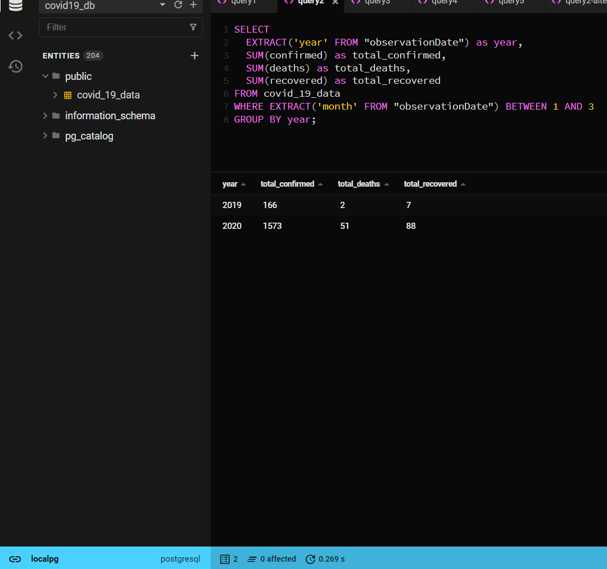

# Covid Data Project

The data analyzed in this project is a sample data related to recorded cases of COVID-19 from January 2019 to December 2020.


| Column         | Description                                             |  Type   |
|----------------|---------------------------------------------------------|---------|
|serialNumber    |A unique serial number for the observation record        |Integer  |
|observationDate |The date when the observation was made.                  |String   |
|state           |The province or state in which the observation was made  |String   |
|country         |The country or region which the observation was made.    |String.  |
|lastUpdated     |The date and time observation was last updated.          |String.  |
|confirmed       |The number of confirmed cases that were observed.        |String.  |
|deaths          |The number of deaths that were observed                  |.        |
|recovered       |The number of recoveries that were observed.             |.        |


## Project Setup
- To run the code and queries locally, clone the repo and create your virtual environment, then install the required python libraries in the virtual environment using the command below:

```bash
pip install -r requirements.txt
```

- Create a `.env` file and supply the environment variables listed in the [.env.example](.env.example) file together with thier corresponding values

- Run the [python script](./main.py) to download the covid-19 csv file from a google drive link and then load the data a PostgreSQL database whose credentials must have been supplied in your `.env` file as stated in the step above

## Analysis
1. Total confirmed, death, and recovered cases.

    

2. Total confirmed, deaths and recovered cases for the first quarter of each year of observation.
    

3. Retrieve a summary of all the records. This should include the following information for each country:
    - The total number of confirmed cases
    - The total number of deaths
    - The total number of recoveries

    

4. Percentage increase in the number of death cases from 2019 to 2020.

    

5. Top 5 countries with the highest confirmed cases.

    

6. Total number of drop (decrease) or increase in the confirmed
cases from month to month in the 2 years of observation.

    
